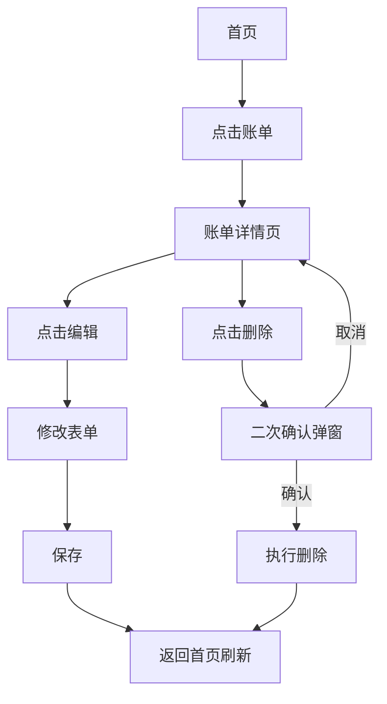

# 甜酒账簿 PRD（V1）

## 1. 文档信息

| 字段 | 内容 |
|------|------|
| 产品名称 | 甜酒账簿 |
| 版本 | V1.0（MVP） |
| 目标平台 | 微信小程序 |
| 技术框架 | Taro + React + TypeScript |
| 面向用户 | 通用大众用户（个人日常收支管理） |
| 文档状态 | 可评审 |
| 最后更新 | 2026-03-24 |

---

## 2. 产品背景与目标

### 2.1 背景

很多用户有记账意愿，但常因流程复杂、反馈不直观而放弃。甜酒账簿 V1 以"轻量、快速、可持续"为原则，优先解决"快速记账"和"清晰查看收支"两个核心痛点。

### 2.2 V1 目标

- 用户首次进入 1 分钟内可完成第一笔记账。
- 用户可随时看到当月收入、支出、结余。
- 用户可按时间和分类快速回查账单。

### 2.3 成功标准（业务目标）

| 指标 | 目标值 |
|------|--------|
| 首次打开后 24 小时内记账完成率 | ≥ 45% |
| 7 日留存率 | ≥ 20% |
| 日均记账笔数 | ≥ 1.8 |
| 账单保存失败率 | ≤ 0.5% |

---

## 3. 用户与核心场景

### 3.1 目标用户画像（MVP）

- 18~40 岁个人用户，日常有消费记录需求
- 不愿投入大量学习和维护成本
- 需要"快速输入 + 基础统计"
- 微信高频用户，习惯小程序轻量工具

### 3.2 核心使用场景

| 场景 | 描述 |
|------|------|
| 场景 A | 餐后即时记一笔支出（主路径） |
| 场景 B | 月底查看本月总支出和主要消费类别 |
| 场景 C | 回查某天/某类账单并修改错误记录 |
| 场景 D | 晚间收到提醒通知，点击直达记账页补记当天支出 |

---

## 4. 产品范围

### 4.1 V1 包含

- 快速记账（收入/支出、金额、分类、日期、备注）
- 账单列表（按天分组、按月查看、分类筛选）
- 基础统计（当月收入支出结余、分类占比、7/30 天趋势）
- 分类管理（系统预置分类 + 自定义分类）
- 设置（昵称、货币）与数据导出（CSV）
- 记账提醒（当天无记账时，在用户设定时间推送微信订阅消息）

### 4.2 V1 不包含

- 多人协作账本
- 复杂资产负债管理
- OCR 识别票据
- AI 智能建议
- 跨端多设备同步高级能力
- 预算设置与超支提醒

---

## 5. 信息架构与页面

### 5.1 导航结构

无底部 TabBar，采用首页为核心的单页导航模式：

```
┌─────────────────────────────────────┐
│ [头像]   甜酒账簿      [统计入口 →] │  ← 首页顶部导航栏
├─────────────────────────────────────┤
│                                     │
│         当月总览卡片                 │
│         账单列表（按天分组）          │
│                                     │
│                      [ + 记一笔 ]   │  ← 底部悬浮按钮（FAB）
└─────────────────────────────────────┘
```

- **启动页**：默认进入首页
- **记一笔**：首页底部悬浮按钮（FAB），始终可见
- **我的页**：点击首页左上角用户头像进入
- **统计页**：首页右上角"统计"文字入口进入
- 无全局 TabBar，各二级页均通过顶部返回键回到首页

### 5.2 页面清单

| 页面 | 入口 | 核心内容 |
|------|------|----------|
| 首页 | 启动默认页 | 当月总览卡片、最近账单列表（按天分组）、FAB 悬浮按钮 |
| 记一笔页 | 首页 FAB 悬浮按钮 | 金额输入、收支切换、分类、日期、备注、保存 |
| 账单详情页 | 首页账单列表 → 点击单条 | 查看、编辑、删除 |
| 统计页 | 首页右上角"统计"入口 | 汇总卡片、支出分类占比饼图、趋势折线图 |
| 分类管理页 | "我的" → 分类管理 | 分类列表、新增、编辑、停用 |
| 设置页 | "我的" → 设置 | 昵称、货币、提醒设置、导出数据 |
| 我的页 | 首页左上角用户头像 | 用户信息、功能入口聚合 |

---

## 6. 核心流程

### 6.1 主记账流程

```mermaid
flowchart TD
  openApp[打开小程序] --> homeView[查看首页月度概览]
  homeView --> addBill[进入记一笔页]
  addBill --> inputAmount[输入金额]
  inputAmount --> chooseCategory[选择分类]
  chooseCategory --> optDate[可选：修改日期]
  optDate --> optNote[可选：填写备注]
  optNote --> submitBill[点击保存]
  submitBill --> validate{校验通过?}
  validate -- 否 --> showError[高亮提示错误字段]
  showError --> inputAmount
  validate -- 是 --> saveResult{保存结果}
  saveResult -- 成功 --> toast[Toast 提示"已保存"] --> syncHome[返回首页并刷新]
  saveResult -- 失败 --> errorTip[失败提示 + 重试按钮]
```

### 6.2 查询与修改流程



---

## 7. 功能详细需求

### 7.1 快速记账

#### 7.1.1 功能说明

- 支持收入 / 支出切换（默认：支出）
- 金额输入支持整数与两位小数，使用数字键盘（非系统键盘）
- 默认日期为当天，可向前修改（不可选未来日期）
- 备注可选，最长 50 字

#### 7.1.2 交互要求

- 进入页面后默认聚焦金额输入区，展示自定义数字键盘
- 数字键盘支持退格与小数点，限制两位小数
- 记住用户最近一次选中的分类（仅当前设备 localStorage）
- 保存成功后 Toast 提示"已保存"，自动返回上一页
- 保存失败时弹出错误提示，提供"重试"操作
- 切换收入/支出时，分类列表联动刷新

#### 7.1.3 校验规则

| 字段 | 规则 | 提示语 |
|------|------|--------|
| 金额 | 必填，> 0，最大 9,999,999.99 | "请输入正确的金额" |
| 分类 | 必选 | "请选择分类" |
| 日期 | 不可晚于今天 | "日期不可晚于今天" |
| 备注 | 可选，≤ 50 字 | "备注不超过 50 字" |

#### 7.1.4 界面布局参考

```
┌──────────────────────────────┐
│  [支出]  [收入]               │  切换 Tab
├──────────────────────────────┤
│        ¥  0.00               │  金额展示区
├──────────────────────────────┤
│  分类：[餐饮 ▼]              │  分类选择（弹出 Picker）
│  日期：[2026-03-24 ▼]        │
│  备注：[选填，最多50字]       │
├──────────────────────────────┤
│     [  保   存  ]            │  主 CTA 按钮
├──────────────────────────────┤
│   1   2   3   ←              │  自定义数字键盘
│   4   5   6   清空            │
│   7   8   9   .              │
│       0       确认            │
└──────────────────────────────┘
```

---

### 7.2 账单列表（首页）

#### 7.2.1 页面布局

```
┌────────────────────────────────────┐
│ [头像] 甜酒账簿          [统计 →]  │  顶部导航栏（固定）
├────────────────────────────────────┤
│  ┌──────────────────────────────┐  │
│  │  本月收入  本月支出   结余    │  │  当月总览卡片
│  └──────────────────────────────┘  │
│  [← 2026-03 →]  [全部 ▼]         │  月份切换 + 分类筛选
│  ─────────── 3月24日 ────────────  │
│  [图标] 餐饮  午饭            -35  │
│  [图标] 交通                  -12  │
│  ─────────── 3月23日 ────────────  │
│  [图标] 工资              +8,000   │
│                                    │
│                    ┌─────────────┐ │
│                    │  + 记一笔   │ │  FAB 悬浮按钮（固定在底部右侧）
│                    └─────────────┘ │
└────────────────────────────────────┘
```

#### 7.2.2 功能说明

- 顶部导航栏固定，左侧显示用户头像（圆形，点击进入我的页），中间显示 App 名称，右侧显示"统计"文字入口
- 头像未登录时展示默认占位图，点击同样进入我的页（引导授权）
- 首页展示当月总览卡片（收入、支出、结余）
- 账单以"日期分组 + 时间倒序"展示，每个日期分组显示当日小计
- 支持按月切换（左右箭头 or 月份 Picker，不可切换到未来月份）
- 支持按分类筛选（单选，点击"全部"重置）
- 列表底部显示当页已加载条数和总条数

#### 7.2.3 FAB 悬浮按钮

- 固定在页面右下角，始终可见（不随页面滚动消失）
- 样式：圆角矩形或胶囊形，内含"＋ 记一笔"文字
- 点击跳转至记一笔页
- 列表滚动时可适当降低按钮透明度（80% → 100% hover），避免遮挡账单内容

#### 7.2.4 空状态

- 当月无数据：展示插图 + "还没有账单，去记一笔吧"，FAB 按钮仍然可见
- 筛选后无数据：展示"当前筛选下没有账单"

#### 7.2.5 账单卡片字段

```
[分类图标]  [分类名称]  [备注（截断20字）]    [金额（红/绿）]
            [日期 HH:mm]
```

---

### 7.3 账单详情与编辑

- 展示账单全字段：类型、金额、分类、日期、备注、创建时间
- 右上角提供"编辑"和"删除"操作
- 编辑状态复用记一笔页表单，预填当前数据
- 删除需二次确认弹窗：标题"确认删除"，内容"删除后不可恢复"，按钮"取消/确认删除"

---

### 7.4 基础统计

#### 7.4.1 展示内容

| 模块 | 内容 |
|------|------|
| 汇总卡片 | 当月总收入、总支出、结余（结余 = 收入 - 支出） |
| 分类占比 | 当月支出各分类金额 + 占比，饼图 + 列表双展示 |
| 收支趋势 | 近 7 天 / 近 30 天切换，折线图（支出为主，可叠加收入） |

#### 7.4.2 统计口径

- 默认按用户本地时区自然日计算
- 统计页默认展示当月数据，支持月份切换（历史查看）
- 结余可为负数，负数时以红色展示

#### 7.4.3 图表交互

- 饼图支持点击扇形高亮，列表对应项联动高亮
- 趋势图 X 轴按日期，Y 轴自适应，数据点支持点击展示当日数值

---

### 7.5 分类管理

#### 7.5.1 系统预置分类

**支出类（system）**

| 图标 | 名称 |
|------|------|
| 🍜 | 餐饮 |
| 🚌 | 交通 |
| 🛒 | 购物 |
| 🏠 | 居家 |
| 🎮 | 娱乐 |
| 💊 | 医疗 |
| 📚 | 教育 |
| ✈️ | 旅行 |
| 📱 | 数码 |
| 💄 | 美容 |
| 👔 | 服装 |
| 🐾 | 宠物 |
| 💡 | 水电煤 |
| 💌 | 人情往来 |
| 📦 | 其他支出 |

**收入类（system）**

| 图标 | 名称 |
|------|------|
| 💰 | 工资 |
| 📈 | 投资收益 |
| 🎁 | 收到红包 |
| 🏆 | 奖金 |
| 🔄 | 兼职收入 |
| 📦 | 其他收入 |

#### 7.5.2 规则

- 系统预置分类不可删除、不可重命名，可停用（停用后不出现在记账选择列表）
- 自定义分类可新增、编辑、停用（不可删除，防误操作造成历史数据分类丢失）
- 分类名称在同类型（收入/支出）下不可重复
- 分类名称长度 1~10 字
- 自定义分类图标：从系统预设图标库选取（V1 不支持自定义上传）
- 排序：系统分类在前，自定义分类在后，均支持拖拽排序

---

### 7.6 设置与导出

| 设置项 | 说明 |
|--------|------|
| 昵称 | 最长 20 字，不可为空 |
| 默认货币 | V1 固定人民币（CNY / ¥），展示用，不做多币种换算 |
| 导出数据 | 按月选择，生成 CSV 文件，通过微信分享或保存到手机 |

#### CSV 导出字段及顺序

```
日期,时间,类型,分类,金额,备注
2026-03-24,12:30,支出,餐饮,35.50,午饭
```

---

### 7.7 记账提醒

#### 7.7.1 功能说明

- 用户可在设置页开启/关闭记账提醒，并自定义提醒时间（精确到分钟）
- 默认提醒时间：21:00，默认状态：关闭（需用户主动授权后才开启）
- 触发条件：当天自然日（用户本地时区）内**没有任何账单记录**，到达提醒时间时推送一条微信订阅消息
- 若当天已有记账，则不推送
- 推送通道：微信**订阅消息**（需用户在小程序内主动授权，授权一次长期有效）

#### 7.7.2 授权流程

```mermaid
flowchart TD
  openSetting[进入设置页] --> toggleReminder[打开提醒开关]
  toggleReminder --> checkAuth{已授权订阅消息?}
  checkAuth -- 是 --> saveConfig[保存提醒配置，开关置为开启]
  checkAuth -- 否 --> requestAuth[调起微信订阅消息授权弹窗]
  requestAuth --> authResult{用户操作}
  authResult -- 同意 --> saveConfig
  authResult -- 拒绝 --> rejectTip[Toast 提示"需要授权才能开启提醒"，开关回落关闭]
```

> 若用户在微信设置中关闭了订阅消息权限，下次开启提醒时重新引导授权。

#### 7.7.3 推送消息内容

| 字段 | 内容 |
|------|------|
| 消息标题 | 今天还没记账哦 |
| 消息内容 | 快来记一笔，让钱花得明明白白 |
| 跳转目标 | 小程序记一笔页（/pages/add/index） |

#### 7.7.4 服务端实现要点

- 后端使用定时任务（Cron，每分钟扫描）查询当前时间命中提醒时间的用户列表
- 查询该用户当天（按其本地时区）是否存在账单记录
- 无记录则通过微信服务端 API 下发订阅消息（`subscribeMessage.send`）
- 发送后写入推送日志，同一用户同一自然日只推送一次
- 用户关闭提醒开关时，服务端标记停止推送（不撤销已有授权）

#### 7.7.5 设置项

| 设置项 | 类型 | 默认值 | 说明 |
|--------|------|--------|------|
| 开启记账提醒 | 开关 | 关 | 需授权订阅消息后生效 |
| 提醒时间 | 时间选择器（HH:mm） | 21:00 | 仅在开关开启时可操作 |

---

## 8. 数据模型（V1）

### 8.1 账单 Bill

```typescript
interface Bill {
  id: string;              // 唯一标识，UUID
  userId: string;          // 用户 OpenID
  type: 'income' | 'expense';
  amount: number;          // 单位：分（避免浮点精度问题）
  categoryId: string;
  note: string;            // 可为空字符串
  billDate: string;        // yyyy-MM-dd，记账日期
  createdAt: number;       // Unix timestamp ms
  updatedAt: number;       // Unix timestamp ms
}
```

### 8.2 分类 Category

```typescript
interface Category {
  id: string;
  userId: string;          // 系统分类为 'system'
  type: 'income' | 'expense';
  name: string;
  icon: string;            // emoji 或图标 key
  isSystem: boolean;
  status: 'active' | 'disabled';
  sort: number;            // 排序权重，越小越靠前
  createdAt: number;
  updatedAt: number;
}
```

### 8.3 用户设置 UserSetting

```typescript
interface UserSetting {
  userId: string;
  nickname: string;
  currency: 'CNY';               // V1 固定
  lastCategoryId: string;        // 最近选中分类 ID（本地缓存）
  reminderEnabled: boolean;      // 是否开启记账提醒，默认 false
  reminderTime: string;          // 提醒时间，格式 HH:mm，默认 "21:00"
  reminderSubscribed: boolean;   // 微信订阅消息是否已授权
  updatedAt: number;
}
```

---

## 9. 接口设计概要（V1）

> 接口均需携带微信登录态（Authorization: Bearer {token}），后端验证 OpenID。

| 方法 | 路径 | 说明 |
|------|------|------|
| POST | /auth/login | 微信授权登录，返回 token |
| GET | /bills | 获取账单列表（支持按月/分类过滤） |
| POST | /bills | 新增账单 |
| PUT | /bills/:id | 编辑账单 |
| DELETE | /bills/:id | 删除账单 |
| GET | /bills/stats | 获取统计汇总数据 |
| GET | /categories | 获取分类列表 |
| POST | /categories | 新增自定义分类 |
| PUT | /categories/:id | 编辑/停用分类 |
| GET | /settings | 获取用户设置 |
| PUT | /settings | 更新用户设置（含提醒配置） |
| POST | /reminder/subscribe | 上报微信订阅消息授权结果 |
| GET | /export/csv | 导出 CSV（query: month=2026-03） |

---

## 10. 非功能需求

| 类型 | 要求 |
|------|------|
| 性能 | 首页首屏可交互时间 < 2.0s（主流机型，常规网络） |
| 稳定性 | 账单保存成功率 ≥ 99.5% |
| 安全 | 仅用户可访问个人账单数据，所有接口需鉴权；金额字段后端二次校验 |
| 弱网 | 操作失败有明确提示 + 重试入口；记账表单数据本地临时缓存（防止表单丢失） |
| 兼容性 | 支持微信基础库 3.0+，兼容 iOS 16+ / Android 10+（覆盖 90% 用户） |
| 包体积 | 小程序主包 ≤ 2MB，分包合理拆分 |

---

## 11. 埋点与指标

### 11.1 核心埋点事件

| 事件名 | 触发时机 | 关键参数 |
|--------|----------|----------|
| app_open | 打开小程序 | source（场景值） |
| page_view | 进入任意页面 | page_name |
| bill_add_start | 进入记一笔页 | - |
| bill_add_submit | 点击保存按钮 | type, categoryId, amount_range |
| bill_add_success | 保存接口成功回调 | bill_id |
| bill_add_fail | 保存接口失败 | error_code |
| bill_edit | 编辑账单保存 | bill_id |
| bill_delete | 删除账单确认 | bill_id |
| stats_view | 进入统计页 | month |
| category_manage | 进入分类管理页 | - |
| export_csv | 导出 CSV 成功 | month |
| reminder_enable | 用户开启记账提醒 | reminder_time |
| reminder_disable | 用户关闭记账提醒 | - |
| reminder_subscribe_success | 订阅消息授权成功 | - |
| reminder_subscribe_fail | 订阅消息授权被拒 | - |
| reminder_click | 用户点击推送消息进入小程序 | - |

### 11.2 看板指标

- 首日记账完成率
- 日均记账笔数
- 7 日留存率
- 统计页访问率
- 账单保存失败率
- 平均记账耗时（bill_add_start → bill_add_success）
- 提醒订阅授权率（授权成功用户数 / 触发授权弹窗用户数）
- 提醒消息点击率（reminder_click / 实际推送条数）

---

## 12. 验收标准（UAT）

### 12.1 功能验收

- [ ] 可完成新增账单完整闭环（收入/支出各一笔）
- [ ] 可完整编辑账单所有字段并保存
- [ ] 删除账单二次确认弹窗正常，删除后列表刷新
- [ ] 首页与统计页同月口径数据完全一致
- [ ] 按月切换、按分类筛选结果正确
- [ ] 分类管理：新增/停用自定义分类后，记账分类列表联动更新
- [ ] 分类名称重复时给出明确提示
- [ ] CSV 导出字段完整、顺序正确、可用 Excel 正常打开
- [ ] 金额边界：输入 0、负数、超大值均有正确拦截提示
- [ ] 日期不可选未来日期
- [ ] 开启提醒开关时正确触发微信订阅消息授权弹窗
- [ ] 用户拒绝授权后开关回落为关闭状态并提示
- [ ] 当天有账单时，到达提醒时间不推送消息
- [ ] 当天无账单时，到达提醒时间正确推送订阅消息
- [ ] 同一用户同一自然日只推送一次
- [ ] 点击推送消息可跳转到记一笔页

### 12.2 非功能验收

- [ ] 首页首屏加载时间 < 2.0s（真机测试）
- [ ] 弱网（2G 模拟）下保存失败时有明确错误提示与重试按钮
- [ ] 无 P0/P1 级缺陷（阻塞主流程）
- [ ] 满足微信小程序提审规范要求

---

## 13. 项目排期（4 周）

| 周次 | 工作内容 |
|------|----------|
| 第 1 周 | 需求冻结、交互稿定稿、数据结构与接口定义、搭建项目基础框架 |
| 第 2 周 | 记账页 + 账单列表 + 账单详情开发联调 |
| 第 3 周 | 统计页、分类管理页、设置与导出、记账提醒（订阅消息授权 + 服务端定时推送）开发联调 |
| 第 4 周 | 全流程测试、性能优化、埋点验证、灰度发布、提审 |

---

## 14. 风险与应对

| 风险 | 可能性 | 应对措施 |
|------|--------|----------|
| 用户坚持记账动力不足 | 高 | 首页增加连续记账天数徽章与轻提醒（规划至 V1.1） |
| 统计口径与列表数据不一致 | 中 | 统一通过统计服务聚合，增加自动化回归校验 |
| 弱网导致保存失败感知差 | 中 | 明确失败提示 + 一键重试 + 表单数据本地临时缓存 |
| 自定义键盘兼容性问题 | 低 | 充分覆盖 iOS/Android 主流机型真机测试 |
| 用户订阅消息授权率低，提醒功能使用率不足 | 中 | 在设置页清晰说明功能价值，授权时机选在用户完成首次记账后引导 |
| 微信订阅消息模板审核未通过 | 低 | 提前申请模板，备用通用模板；确保消息内容符合微信规范 |
| 微信小程序审核被拒 | 低 | 提前对照最新审核规范自查，保留审核记录 |

---

## 15. 后续版本规划（V1.1+）

- 连续记账激励：连续记账天数展示、成就徽章
- 账单搜索（按备注关键词）
- 周/年维度统计
- 月度预算设置与超支提醒
- 数据云端备份与多设备同步
